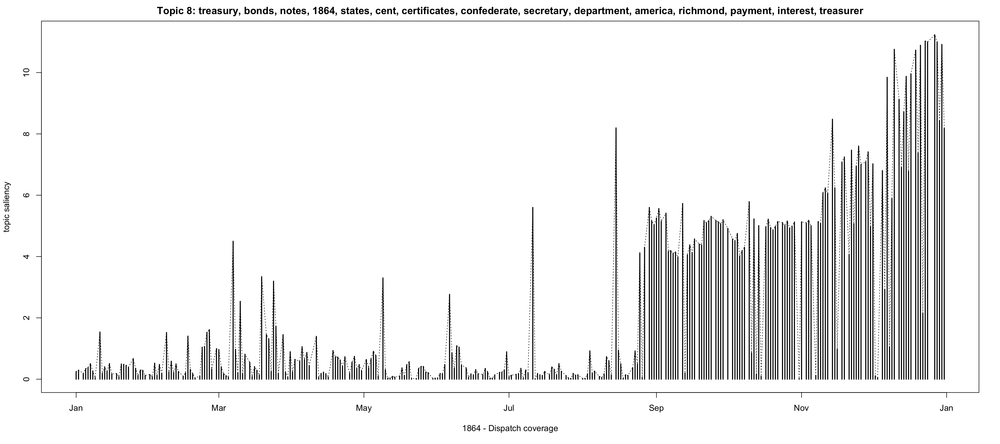

# Text Analysis III: Finding Groups of Texts

```{r echo=FALSE}
library(knitr)
```

## Goals{#goals09}

- introduce text clustering approaches that allow us find groups of thematically similar texts:
  - hierarchical clustering; 
  - k-means clustering;
  - topic modeling;

## Preliminaries{#Prelim09}

### Libraries

The following are the libraries that we will need for this section. Install those that you do not have yet.

```{r message=FALSE}
#install.packages("ggplot2", "LDAvis", "readr", "slam", "stringr", "tictoc", "tidytext", "tidyverse", "tm", "topicmodels")

# general
library(ggplot2)

# text analysis specific
library(readr)
library(slam)
library(stringr)
library(tidytext)
library(tidyverse)
library(tm)
library(topicmodels)

library(text2vec)
library(stylo)

library(cluster)    # clustering algorithms
library(factoextra) # clustering algorithms & visualization

# extra
library(tictoc) # to time operations
```

#### The Dispatch Data: Preprocessing

Texts for experiments:

- [The Richmond Dispatch (1861)](./files/data/dispatch_1861.tsv)
- [The Richmond Dispatch (1862)](./files/data/dispatch_1862.tsv)
- [The Richmond Dispatch (1863)](./files/data/dispatch_1863.tsv)
- [The Richmond Dispatch (1864)](./files/data/dispatch_1864.tsv)

Topic models, pretrained:

- [Topic models trained on 1864](./files/data/d1864_lda_vem_25t_better.rda)
- [Topic models for testing LDAvis](./files/data/dispatch_lda_vem_better.rda)

We will limit to only one year, but, of course, the results are always more interesting with more data...

Loading...

```{r}
d1864 <- read.delim("./files/data/dispatch_1864.tsv", encoding="UTF-8", header=TRUE, quote="", stringsAsFactors = FALSE)
d1864$date <- as.Date(d1864$date, format="%Y-%m-%d")
```


```{r}
knitr::kable(head(d1864, 1), table.attr = "class=\"striped\"", format="html")
```

Let's remove low freq items:

```{r}
d1864_lowFreq <- d1864 %>%
  unnest_tokens(word, text) %>%
  count(word, sort=TRUE)

summary(d1864_lowFreq)
```

```{r}
lowFreq <- d1864_lowFreq %>%
  filter(n <= 1)
summary(lowFreq)
```

Most of these low-frequency items are typos:

```{r}
knitr::kable(head(lowFreq, 15), table.attr = "class=\"striped\"", format="html")
```

We can `anti-join` our corpus with `lowFreq`, which will remove them:

```{r}
d1864_clean <- d1864 %>%
  filter(type != "ad_blank")

d1864_clean <- d1864_clean %>%
  unnest_tokens(word, text) %>%
  anti_join(lowFreq, by="word") %>%
  group_by(id) %>%
  count(word, sort=TRUE)

# unfiltered:      2,815,144
# filtered (>3):   2,749,078
```

Additionally, we need to remove `stop words`, but first we need to identify them.

```{r}
d1864_clean_FL <- d1864_clean %>%
  group_by(word) %>%
  summarize(freq=sum(n)) %>%
  arrange(desc(freq))

knitr::kable(head(d1864_clean_FL, 15), table.attr = "class=\"striped\"", format="html")
```

To make things faster, you can remove top 50, 100, 150, 200 most frequent words, but this is a rather brutal way. Ideally, you want to curate your own stop word list that will be tuned to your texts. Below, I have taken top 500 words and manually removed everything that was meaningful (or, better, what I *considered* meaningful). Additionally, there are also NLP procedures that are designed to lemmatize words (i.e., reduce all words to their dictionary forms) and also do part-of-speech tagging, which allows to remove words categorically (for example, keeping only nouns, adjectives and verbs). 

```{r}
word <- c("the", "of", "and", "to", "in", "a", "that", "for", "on", "was", "is", "at", "be", "by", "from", "his", "he", "it", "with", "as", "this", "will", "which", "have", "or", "are", "they", "their", "not", "were", "been", "has", "our", "we", "all", "but", "one", "had", "who", "an", "no", "i", "them", "about", "him", "two", "upon", "may", "there", "any", "some", "so", "men", "when", "if", "day", "her", "under", "would", "c", "such", "made", "up", "last", "j", "time", "years", "other", "into", "said", "new", "very", "five", "after", "out", "these", "shall", "my", "w", "more", "its", "now", "before", "three", "m", "than", "h", "o'clock", "old", "being", "left", "can", "s", "man", "only", "same", "act", "first", "between", "above", "she", "you", "place", "following", "do", "per", "every", "most", "near", "us", "good", "should", "having", "great", "also", "over", "r", "could", "twenty", "people", "those", "e", "without", "four", "received", "p", "then", "what", "well", "where", "must", "says", "g", "large", "against", "back", "000", "through", "b", "off", "few", "me", "sent", "while", "make", "number", "many", "much", "give", "1", "six", "down", "several", "high", "since", "little", "during", "away", "until", "each", "5", "year", "present", "own", "t", "here", "d", "found", "reported", "2", "right", "given", "age", "your", "way", "side", "did", "part", "long", "next", "fifty", "another", "1st", "whole", "10", "still", "among", "3", "within", "get", "named", "f", "l", "himself", "ten", "both", "nothing", "again", "n", "thirty", "eight", "took", "never", "came", "called", "small", "passed", "just", "brought", "4", "further", "yet", "half", "far", "held", "soon", "main", "8", "second", "however", "say", "heavy", "thus", "hereby", "even", "ran", "come", "whom", "like", "cannot", "head", "ever", "themselves", "put", "12", "cause", "known", "7", "go", "6", "once", "therefore", "thursday", "full", "apply", "see", "though", "seven", "tuesday", "11", "done", "whose", "let", "how", "making", "immediately", "forty", "early", "wednesday", "either", "too", "amount", "fact", "heard", "receive", "short", "less", "100", "know", "might", "except", "supposed", "others", "doubt", "set", "works") 

sWordsDF <- data.frame(word)

d1864_clean_minusSW <- d1864_clean %>%
  anti_join(sWordsDF, by="word")
```

```{r}
dim(d1864_clean)
# 1,759,828
```

```{r}
dim(d1864_clean_minusSW)
# 1,159,214
```

### TF-IDF

> **From Wikipedia**: In information retrieval, tf–idf or TFIDF, short for term frequency–inverse document frequency, is a numerical statistic that is intended to reflect how important a word is to a document in a collection or corpus.[1] It is often used as a weighting factor in searches of information retrieval, text mining, and user modeling. The tf–idf value increases proportionally to the number of times a word appears in the document and is offset by the number of documents in the corpus that contain the word, which helps to adjust for the fact that some words appear more frequently in general. tf–idf is one of the most popular term-weighting schemes today; 83% of text-based recommender systems in digital libraries use tf–idf. Variations of the tf–idf weighting scheme are often used by search engines as a central tool in scoring and ranking a document's relevance given a user query. tf–idf can be successfully used for stop-words filtering in various subject fields, including text summarization and classification. One of the simplest ranking functions is computed by summing the tf–idf for each query term; many more sophisticated ranking functions are variants of this simple model.

```{r}
df_TF_IDF <- d1864_clean_minusSW %>% # d1864_clean, d1864_clean_minusSW
  bind_tf_idf(word, id, n) %>%
  arrange(desc(tf_idf)) %>%
  ungroup

knitr::kable(head(df_TF_IDF, 15), table.attr = "class=\"striped\"", format="html")

```

```{r}
articleID = "1864-07-25_article_6"
filter(df_TF_IDF, id==articleID) %>%
  arrange(desc(tf_idf))
```

```{r}
d1864$text[d1864$id==articleID]
```

## Clustering

### Hierarchical clustering

Clustering is a method to break items into closely related groups---clusters. The code below show how our data can be broken into clusters with hierarchical clustering, using distance matrices. Hierarchical clustering has rather high precision, but sensitive to outliers and computationally expensive, which makes it nearly unusable with large datasets. K-means clustering is more suitable for large datasets, but struggles with uniform data. <!--([for example](https://www.inovex.de/blog/disadvantages-of-k-means-clustering/))--> In both cases you have to define the number of clusters.

In what follows, we take our TF-IDF data, sample it, and run cluster analysis on a small sample. The chunk below simply prepares our data for analysis:

```{r}
# RANDOMLY SELECT N ITEMS
set.seed(48965)
N = 100
sampledIDs <- sample(unique(df_TF_IDF$id), N)
sample_d1864_tfidf <- df_TF_IDF %>% filter(id %in% sampledIDs) %>%
  select(id, word, tf_idf)

# CONVERT INTO DTM MATRIX
colnames(sample_d1864_tfidf) <- c("document", "term", "count")
sample <- tibble(sample_d1864_tfidf) %>% cast_dtm(document, term, count)
sample_matrix <- as.matrix(sample)

# CONVERT INTO REGULAR MATRIC AND CALCULATE DISTANCES
distanceMatrix <- dist.cosine(sample_matrix) # from library(stylo)
distanceMatrixHC <- as.dist(distanceMatrix)
```

Now we can do the actual clustering. There are several clustering/linkage methods that can be used for clustering, and it usually depends on your goals.

> **From `?hclust`**: "A number of different clustering methods are provided. Ward's minimum variance method aims at finding compact, spherical clusters. The complete linkage method finds similar clusters. The single linkage method (which is closely related to the minimal spanning tree) adopts a ‘friends of friends’ clustering strategy. The other methods can be regarded as aiming for clusters with characteristics somewhere between the single and complete link methods. Note however, that methods "median" and "centroid" are not leading to a monotone distance measure, or equivalently the resulting dendrograms can have so called inversions or reversals which are hard to interpret ..."

As a rule of thumb: you want balanced trees when you want an even number of items assigned to each cluster. Unbalanced trees are useful for finding outliers --- with this method you can find which items you might want to remove in order to achieve better clustering.

You can find additional explanations [here](https://towardsdatascience.com/introduction-hierarchical-clustering-d3066c6b560e#:~:text=There%20are%20two%20types%20of,agglomerative%20(bottom%2Dup)).

```{r}
# THE FOLLOWING IS THE ACTUAL CLUSTERING   
clustered.data.ward <- hclust(distanceMatrixHC, method = "ward.D")
clustered.data.complete <- hclust(distanceMatrixHC, method = "complete")
clustered.data.average <- hclust(distanceMatrixHC, method = "average")
clustered.data.single <- hclust(distanceMatrixHC, method = "single")

str(clustered.data.ward)
```


```{r}
plot(clustered.data.ward, labels=FALSE, main="Ward")
abline(h=1.25, col="blue", lty=3)
rect.hclust(clustered.data.ward, k=10, border="red")
```

You can use `rect.hclust()` either with `h=` --- which will *cut tree* at a given height, thus determining the number of clusters; or, with `k=` --- which will *cut tree* into a given number of clusters.

## PCA viz for HCLUST

Note that PCA (principal component analysis) and clustering are not the same, but PCA can be also used to visualize hierarchical clustering:

```{r}
library(factoextra)

set.seed(1)
distanceMatrixHC.scaled <- scale(distanceMatrixHC)
hc.cut <- hcut(distanceMatrixHC.scaled, k = 3, hc_method = "ward.D")
fviz_cluster(hc.cut, labelsize=0, ellipse.type = "convex")

```


```{r}
plot(clustered.data.complete, labels=FALSE, main="Complete")
```

```{r}
plot(clustered.data.average, labels=FALSE, main="Average")
```

```{r}
plot(clustered.data.single, labels=FALSE, main="Single")
```

`hclust()` creates an object from which you can extract further information. For example, we can use `cutree()` function to extract clustering information. You can use `cutree()` either with `h=` --- which will *cut tree* at a given height, thus determining the number of clusters; or, with `k=` --- which will *cut tree* into a given number of clusters.

```{r}
clusters_named_vector <- cutree(clustered.data.ward, k=10)
clusters_df <- stack(clusters_named_vector)
colnames(clusters_df) <- c("cluster", "id")
clusters_df <- clusters_df %>% select(id, cluster)

knitr::kable(head(clusters_df, 15), table.attr = "class=\"striped\"", format="html")

```
We can then `left_join` these clustering results with the original table and manually check if our clustering makes sense.

```{r}
d1864_clustering <- d1864 %>%
  left_join(clusters_df, by = "id")
```

Let's print out a few clusters:

```{r}
cluster <- d1864_clustering %>% filter(cluster == 9) %>%
  select(text)

knitr::kable(cluster, table.attr = "class=\"striped\"", format="html")
```

```{r}
cluster <- d1864_clustering %>% filter(cluster == 7) %>%
  select(text)

knitr::kable(cluster, table.attr = "class=\"striped\"", format="html")
```

```{r}
cluster <- d1864_clustering %>% filter(cluster == 5) %>%
  select(text)

knitr::kable(cluster, table.attr = "class=\"striped\"", format="html")
```
### Determining the optimal number of clusters: "Elbow Method" and "Average Silhouette Method"

In a nutshell, we repeatedly run clustering, increasing the number of clusters by one, and calculate the total within-cluster sum of square (*wss*). We then plot the curve of *wss* and look for a point in the curve with the sharpest bend (hence the "elbow"), which is considered to be an indicator of the appropriate number of clusters. `library(factoextra)` can perform this with a single command:

```{r}
set.seed(786)
fviz_nbclust(as.matrix(distanceMatrixHC), FUN = hcut, k.max=10, method = "wss")
```

Ideally, we sould have something like `L` or `V`. Here, perhaps, 3 is our optimal number. We can try another method --- *average silhouette method* (which is also easily callable from `library(factoextra)`). Like with *elbow method*, we run clustering multiple times but here we measures the quality of a clustering, but determining how well each object lies within its cluster. A high average silhouette width indicates a good clustering.

```{r}
set.seed(786)
fviz_nbclust(as.matrix(distanceMatrixHC), FUN = hcut, k.max = 10, method = "silhouette")
```

More on hierarchical clustering: "Hierarchical Cluster Analysis", in in *U of Cincinnati Business Analytics R Programming Course* <http://uc-r.github.io/hc_clustering>.

## K-means clustering

Let's get a different sample from our data. With k-means clustering we can run on more data:

```{r}
# RANDOMLY SELECT N ITEMS
set.seed(48965)
N = 1000
sampledIDs <- sample(unique(df_TF_IDF$id), N)
sample_d1864_tfidf <- df_TF_IDF %>% filter(id %in% sampledIDs) %>%
  select(id, word, tf_idf)

# CONVERT INTO DTM MATRIX
colnames(sample_d1864_tfidf) <- c("document", "term", "count")
sample <- tibble(sample_d1864_tfidf) %>% cast_dtm(document, term, count)
sample_matrix <- as.matrix(sample)

# CONVERT INTO REGULAR MATRIC AND CALCULATE DISTANCES
distanceMatrix <- dist.cosine(sample_matrix) # from library(stylo)
distanceMatrixKM <- as.dist(distanceMatrix)
```


```{r}
kmeansClusters <- kmeans(distanceMatrixKM, centers=5, nstart=25)
str(kmeansClusters)
```

We can extract cluster information in the same manner as with `hclust()` object:

```{r}
kmeans_clusters_df <- stack(kmeansClusters$cluster)
colnames(kmeans_clusters_df) <- c("cluster", "id")
kmeans_clusters_df <- kmeans_clusters_df %>% select(id, cluster)

head(kmeans_clusters_df)
```

We can visualize the results of our kmeans clustering using `fviz_cluster()` (from `factoextra`). Our data is multidimensional --- each word in our matrix is a single dimension, so this function will perform principal component analysis (PCA) and plot data according to the first two principal components that explain majority of the variance in our dataset.

```{r}
set.seed(786)
fviz_cluster(kmeansClusters, data = distanceMatrix, labelsize = 0)
```

## Determining the optimal number of clusters: "Elbow Method" and "Average Silhouette Method"

In a nutshell, we repeatedly run clustering, increasing the number of clusters by one, and calculate the total within-cluster sum of square (*wss*). We then plot the curve of *wss* and look for a point in the curve with the sharpest bend (hence the "elbow"), which is considered to be an indicator of the appropriate number of clusters. `library(factoextra)` can perform this with a single command:

```{r}
set.seed(786)
fviz_nbclust(as.matrix(distanceMatrix), kmeans, k.max=20, method = "wss")
```

Ideally, we should have something like `L` or `V`. Here results do not seem to be very helpful. We can try another method --- *average silhouette method* (which is also easily callable from `library(factoextra)`). Like with *elbow method*, we run clustering multiple times but here we measures the quality of a clustering, bu determining how well each object lies within its cluster. A high average silhouette width indicates a good clustering.

```{r}
set.seed(786)
fviz_nbclust(as.matrix(distanceMatrix), kmeans, k.max = 20, method = "silhouette")
```

Let's try to visualize our clusters again:

```{r}
set.seed(786)
kmeansClusters <- kmeans(distanceMatrixKM, centers=5, nstart=25)
fviz_cluster(kmeansClusters, data = distanceMatrix, labelsize = 0)
```

Here is, however, an example of where k-means clustering may/can fail: we gave a different starting point to the algorithm and 

```{r}
set.seed(786)
kmeansClusters <- kmeans(distanceMatrixKM, centers=5, nstart=50)
fviz_cluster(kmeansClusters, data = distanceMatrix, labelsize = 0)
```


More information, see:

- "K-means Cluster Analysis", in *U of Cincinnati Business Analytics R Programming Course* <https://uc-r.github.io/kmeans_clustering>.
- <https://towardsdatascience.com/k-means-clustering-algorithm-applications-evaluation-methods-and-drawbacks-aa03e644b48a>

## Other "clustering" methods

Although not cluster analysis techniques strictly speaking, PCA (principal component analysis) and MDS (multi-dimensional scaling) are used in similar ways. We will touch upon these in the context of stylometry. 

## Topic Modeling

### Topics?

#### Example 1

*Thursday, March 27, 1862*

**LIGHT ARTILLERY**

—I am authorized by the Governor of Virginia to raise a Company of Light Artillery for the war. All those desirous of enlisting in this the most effective arm of the service, would do well to call at once at the office of Johnson & Guigon, Whig Building.

Uniforms and subsistence furnished.

A. B. GUIGON. mh 25—6t

#### Example 2

*Wednesday, August 17, 1864*

**Royal Marriages.**

—There is a story circulated in Germany, and some in Paris, that the match between the heir-apparent of the Imperial throne of Russia and the Princess Dagmar of Denmark having been definitively broken off, another is in the course of negotiation between His Imperial Highness and the Princess Helens of England.

#### Example 3

*Monday, June 22, 1863*

**NEWS FROM EUROPE.**

The steamship Scotia arrived at New York on Thursday from Europe, with foreign news to the 7th inst. The news is not important. The Confederate steamer Lord Clyde was searched by order of the British Government, but nothing contraband being found on board her she was permitted to sail. The Russians have been defeated near Grochoury by the Polish insurgents. The three Powers have sent an earnest note to Russia, asking for a representative Government, a general amnesty, and an immediate cessation of hostilities in Poland.

### Getting to code

We can start with our preprocessed variable `d1864_clean`, which is essentially a cumulative frequency list for all articles.

```{r}
library(tm)
library(topicmodels)
library(tictoc)
```

```{r}
head(d1864_clean_minusSW)
```

```{r}
d1864_dm <- d1864_clean_minusSW %>%
  cast_dtm(id, word, n)
d1864_dm
```

Training a model. **NB**: `eval=FALSE` setting will prevent from running this chunk when you `Knit` the notebook; but you can still execute it within the notebook, when you run chunks individually

```{r eval=FALSE}
tic()

d1864_lda <- LDA(d1864_dm, k = 4, control = list(seed = 1234))
d1864_lda

toc()

#A LDA_VEM topic model with 2 topics.
#35.962 sec elapsed

#A LDA_VEM topic model with 4 topics.
#72.545 sec elapsed
```

**Do not run this!**

```{r eval=FALSE}
tic()

kVal <- 25
d1864_lda_better <- LDA(d1864_dm, k=kVal, control=list(seed=1234))

toc()

#A LDA_VEM topic model with 20 topics.
#1261.087 sec elapsed (21 minutes)

#A LDA_VEM topic model with 25 topics.
#1112.262 sec elapsed (18 minutes)

```

Save/load the model, so that there is no need to regenerate it every time.

```{r}

#d1864_lda_vem_25t_better <- d1864_lda_better
#save(d1864_lda_vem_25t_better, file="./files/data/d1864_lda_vem_25t_better.rda")
#load(file="./data/d1864_lda_vem_25t_better.rda")

```

```{r}
load(file="./files/data/d1864_lda_vem_25t_better.rda")
lda_model <- d1864_lda_vem_25t_better
corpus <- d1864
```

From this point on, the code should simply run --- if you rename your own model produced above to `lda_model`.

## Per-topic-per-word probabilities (*beta*)

```{r}
lda_model_better_topic_term_prob <- tidy(lda_model, matrix="beta")

lda_model_better_topic_term_prob %>%
  filter(term == "bonds") %>%
  arrange(desc(beta))
```

**NB:** This step may throw an error. The error seems a bit cryptic, but restarting R (without saving workspace) seems to help. (*beta* stands for term-per-topic probability).

```{r}

top_terms <- lda_model_better_topic_term_prob %>%
  group_by(topic) %>%
  top_n(15, beta) %>%
  ungroup() %>%
  arrange(topic, -beta)

head(top_terms)

```

```{r fig.height=5, fig.width=9}

library(ggplot2)

top_terms %>%
  mutate(term = reorder(term, beta)) %>%
  ggplot(aes(term, beta, fill = factor(topic))) +
  geom_col(show.legend=FALSE) +
  facet_wrap(~topic, scales = "free") +
  coord_flip()

```
Here it is in a bit of a better quality:


Topic-per-document probabilities: this object will tell us to which topics documents belong (and to what extent):
(*gamma* stands for topic-per-document probability).

```{r}
lda_model_topic_doc_prob <- tidy(lda_model, matrix="gamma")
lda_model_topic_doc_prob
```

(@) Pick a document and print out topics it belongs to (from the most prominent to less prominent). (Hint: use the object we just created > filter > arrange).

```{r}

# your code here

```

Top N documents per topic: this will create an object with top N documents per each topic.

```{r}

N = 10

top_docs <- lda_model_topic_doc_prob %>%
  group_by(topic) %>%
  top_n(N, gamma) %>%
  ungroup() %>%
  arrange(topic, -gamma)

top_docs
```

Now that we have IDs of representative documents, we can check those documents one by one, but let's do something else first: topic-title function—--it is not really necessary, but it will combine together topic number (from the model) and its top words, which can be used for graphs.

```{r}
topicVar <- function(top, topTerms){
  topicVar <- topTerms %>%
    filter(topic == top) %>%
    arrange(-beta)
  vals = paste(topicVar$term, collapse=", ")
  as.String(paste(c("Topic ", top, ": ", vals), collapse=""))
}
```


```{r}
topicNum = 8 
idTest   = "1864-08-31_orders_74"

topicVar(topicNum, top_terms)
print("---")
as.String(d1864[d1864$id==idTest, ]["text"])
```

###  Topics over time

```{r}

corpus_light <- corpus %>%
  select(-header, -text)

lda_model_topics <- lda_model_topic_doc_prob %>%
  rename(id=document) %>%
  left_join(corpus_light, by="id") %>%
  group_by(topic, date) %>%
  summarize(freq=sum(gamma))

lda_model_topics

```

Now, we can plot topic distribution over time:

```{r fig.height=4, fig.width=9}
topicVal = 8

lda_model_topics_final <- lda_model_topics %>%
  filter(topic == topicVal)

plot(x=lda_model_topics_final$date, y=lda_model_topics_final$freq, type="l", lty=3, lwd=1,
     main=topicVar(topicVal, top_terms),
     xlab = "1864 - Dispatch coverage", ylab = "topic saliency")
segments(x0=lda_model_topics_final$date, x1=lda_model_topics_final$date, y0=0, y1=lda_model_topics_final$freq, lty=1, lwd=2)

```



### Exploring topics

`LDAvis` offers a visual browser for topics, which has already became a very popular tool for this purpose. If everything is done right, a visualization similar to the one below should open in a browser.


We can use the following function that extracts all needed information from a model and converts it into a format that `LDAvis` expects:

```{r}
library(LDAvis)
library(slam)

topicmodels2LDAvis <- function(x, ...){
  post <- topicmodels::posterior(x)
  if (ncol(post[["topics"]]) < 3) stop("The model must contain > 2 topics")
  mat <- x@wordassignments
  LDAvis::createJSON(
    phi = post[["terms"]], 
    theta = post[["topics"]],
    vocab = colnames(post[["terms"]]),
    doc.length = slam::row_sums(mat, na.rm = TRUE),
    term.frequency = slam::col_sums(mat, na.rm = TRUE)
  )
}
```

```{r eval=FALSE}
serVis(topicmodels2LDAvis(lda_model))
```

**NB**: there are some issues with `LDAvis` and for some reason it does not always parse out a topic model object. We can try loading another one, which does work: this is a 20 topic model based on issues of the Dispatch covering the period of 1861-1864. 

```{r eval=FALSE}
load(file="./files/data/dispatch_lda_vem_better.rda")
serVis(topicmodels2LDAvis(dispatch_lda_vem_better))
```

## Addendum: different distances code sample

This is simply a chunk of code that you can reuse for generating different distances. This code will not run because there is no variable `YOUR_MATRIX`!

```{r eval=FALSE}
#library(stylo)

# USING library(stylo) FUNCTIONS
if (distanceMethod == "cosine"){distanceMatrix <- dist.cosine(YOUR_MATRIX)
} else if (distanceMethod == "delta"){distanceMatrix <- dist.delta(YOUR_MATRIX)
} else if (distanceMethod == "argamon"){distanceMatrix <- dist.argamon(YOUR_MATRIX)
} else if (distanceMethod == "eder"){distanceMatrix <- dist.eder(YOUR_MATRIX)
} else if (distanceMethod == "minmax"){distanceMatrix <- dist.minmax(YOUR_MATRIX)
} else if (distanceMethod == "enthropy"){distanceMatrix <- dist.enthropy(YOUR_MATRIX)
} else if (distanceMethod == "simple"){distanceMatrix <- dist.simple(YOUR_MATRIX)
} else if (distanceMethod == "wurzburg"){distanceMatrix <- dist.wurzburg(YOUR_MATRIX)
# USING dist() FUNCTION
} else if (distanceMethod == "euclidean"){distanceMatrix <- dist(YOUR_MATRIX, method="euclidean")
} else if (distanceMethod == "maximum"){distanceMatrix <- dist(YOUR_MATRIX, method="maximum")
} else if (distanceMethod == "manhattan"){distanceMatrix <- dist(YOUR_MATRIX, method="manhattan")
} else if (distanceMethod == "canberra"){distanceMatrix <- dist(YOUR_MATRIX, method="canberra")
} else if (distanceMethod == "binary"){distanceMatrix <- dist(YOUR_MATRIX, method="binary")
} else if (distanceMethod == "minkowski"){distanceMatrix <- dist(YOUR_MATRIX, method="minkowski")

distanceMatrix <- as.dist(distanceMatrix)
clustered.data <- hclust(distanceMatrix, method = clusteringMethod)

```


...


## Homework{#HW09}

* given in the chapter.

## Submitting homework{#SHW09}

* Homework assignment must be submitted by the beginning of the next class;
* Email your homework to the instructor as attachments.
	*  In the subject of your email, please, add the following: `57528-LXX-HW-YourLastName-YourMatriculationNumber`, where `LXX` is the number of the lesson for which you submit homework; `YourLastName` is your last name; and `YourMatriculationNumber` is your matriculation number.
	
## Additional Materials{#SWH09}

* Chapter 3 "Analyzing word and document frequency: tf-idf" in: Silge, Julia, and David Robinson. 2017. *Text Mining with R: A Tidy Approach*. First edition. Beijing Boston Farnham: O´Reilly. <https://www.tidytextmining.com/>. Available online: <https://www.tidytextmining.com/tfidf.html>
* Chapter 6 "Topic modeling" in: Silge, Julia, and David Robinson. 2017. *Text Mining with R: A Tidy Approach*. First edition. Beijing Boston Farnham: O´Reilly. <https://www.tidytextmining.com/>. Available online: <https://www.tidytextmining.com/topicmodeling.html>
* Chapter on Topic Modeling in:  Benjamin Soltoff. *MACS 305001: Computing for the Social Sciences*, University of Chicago, <https://cfss.uchicago.edu/notes/topic-modeling/>
* David Meza. *Topic Modeling using R*, <https://knowledger.rbind.io/post/topic-modeling-using-r/>
* Grün, Bettina, and Kurt Hornik. 2011. “Topicmodels: An R Package for Fitting Topic Models.” *Journal of Statistical Software* 40 (13). <https://doi.org/10.18637/jss.v040.i13>.
