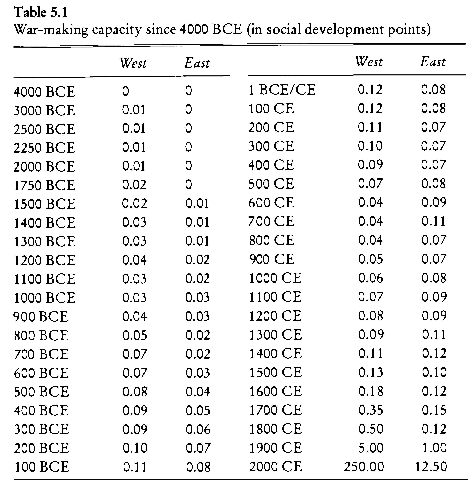

--- 
title: "DH in AAS - TA with R (2022S)"
author: "Maxim G. Romanov"
date: "`r Sys.Date()`"
description: "This is a collection of relevant materials for the class '57-528 ONLINE S: Digital Humanities in African and Asian Studies: Text Analysis with R' (2022S), offered at the University of Hamburg (Afrika-Asien Institut) and taught by Maxim G. Romanov"
url: 'https\://eis1600.github.io/course_TA_R_2022S/'
github-repo: "EIS1600/course_TA_R_2022S"
apple-touch-icon: "touch-icon.png"
apple-touch-icon-size: 120
favicon: "favicon.ico"
documentclass: book
link-citations: yes
bibliography:
- book.bib
- packages.bib
biblio-style: apalike
---

# Syllabus{-}

## Course Details{-}

* Course: 57-528 ONLINE S: Digital Humanities in African and Asian Studies: Text Analysis with R (2022S) / 57-528 ONLINE S: Digitale Geisteswissenschaften in den Afrika-Asien-Studien: Textanalyse mit R
* Language of instruction: English
* Meeting time: Fr 12:00-14:00
* Additional meeting time: *we will need to find a time slot when you can all join and work on your HW assignments together*
* Meeting place: due to COVID, all meetings will be held online via Zoom
* Meeting link: *shared via Slack*; other details are available via STiNE
* Office hours: Fr 14:00-15:00 (on Zoom); if you have any questions, please, post them on Slack
* Instructor: Dr. Maxim Romanov, [maxim.romanov@uni-hamburg.de](maxim.romanov@uni-hamburg.de)

## Aims, Contents and Method of the Course

The course will offer a practical introduction into R programming language, which is currently one of the most popular choices of humanists interested in investigating humanities problems with computational methods. The focus of the course is text analysis. The course will have three main parts: first, you will be introduced to the basics of R; second, you will learn about main text analysis methods; third, you will work on your own text analysis project. The language of the course is English.

Personal computers are required both for in-class work and for your homework (running full versions of either Windows, MacOS, or Linux; unfortunately, neither tablets nor Chrome-based laptops are suitable for this course). No prior programming experience is required, but familiarity with the command line and basic principles of programming will be beneficial.

## Course Evaluation 

Course evaluation will be a combination of:

- in-class participation (30%),
- weekly homework workbooks (25%),
- DataCamp courses (25%),
- and the final project (20%).

Final projects can be prepared either individually or in groups.

### DataCamp

This class is supported by [DataCamp](https://www.datacamp.com/), the most intuitive learning platform for data science and analytics. Learn any time, anywhere and become an expert in R, Python, SQL, and more. DataCamp’s learn-by-doing methodology combines short expert videos and hands-on-the-keyboard exercises to help learners retain knowledge. DataCamp offers 350+ courses by expert instructors on topics such as importing data, data visualization, and machine learning. They’re constantly expanding their curriculum to keep up with the latest technology trends and to provide the best learning experience for all skill levels. Join over 6 million learners around the world and close your skills gap.

You should all get access to [DataCamp](https://www.datacamp.com/) for the durations of the semester. If you cannot access it, please, contact me as soon as possible.


## Class Participation

Each class session will consist in large part of practical hands-on exercises led by the instructor. BRING YOUR LAPTOP! We will accommodate whatever operating system you use (Windows, Mac, Linux), but it should be a laptop rather than a tablet. Don’t forget that asking for help counts as participation!

## Homework

Just as in research and real life, collaboration is a very good way to learn and is therefore encouraged. If you need help with any assignment, you are welcome to ask a fellow student. If you do work together on homework assignments, then when you submit it please include a brief note (just a sentence or two) to indicate who did what.

**NB:** On submitting homework, see below.

## Final Project

Final project will be discussed later. You will have an option to build on what we will be doing in class, but you are most encouraged to pick a topic of your own. The best option will be to work on something relevant to your field of study, your term paper or your thesis.

## Practice Worksheets (R Notebooks)

- [01_worksheets_familiar-with-r.Rmd.zip](./files/ws/01_worksheets_familiar-with-r.Rmd.zip)
- [02_worksheets_data-structures.Rmd.zip](./files/ws/02_worksheets_data-structures.Rmd.zip)
- [03_worksheets_data-manipulation-introduction.Rmd.zip](./files/ws/03_worksheets_data-manipulation-introduction.Rmd.zip)
- [04_worksheets_data-manipulation-continued.Rmd.zip](./files/ws/04_worksheets_data-manipulation-continued.Rmd.zip)
- [05_worksheets_ggplot2-introduction-MGR-mod.Rmd.zip](./files/ws/05_worksheets_ggplot2-introduction-MGR-mod.Rmd.zip)
- [06_worksheets_functions.Rmd.zip](./files/ws/06_worksheets_functions.Rmd.zip)

*NB*: Worksheets 1-6 have been developed by Lincoln Mullen. Source: Lincoln A. Mullen, *Computational Historical Thinking: With Applications in R (2018–)*: <http://dh-r.lincolnmullen.com>.

## Additional Study Materials

* Silge, Julia, and David Robinson. *Text Mining with R: a Tidy Approach* <https://www.tidytextmining.com/>
* Jockers, Matthew L. *Text Analysis with R for Students of Literature*. New York: Springer, 2014 (shared via Slack)
* Arnold, Taylor, and Lauren Tilton. *Humanities Data in R*. New York, NY: Springer Science+Business Media, 2015 (shared via Slack)
* Healy, Kieran. *Data Visualization: A Practical Guide.* Princeton University Press, 2018. ISBN: 978-0691181622. <http://socviz.co/>
* Hadley Wickham & Garrett Grolemund, *R for Data Science: Import, Tidy, Transform, Visualize, and Model Data.* O’Reilly, 2017. ISBN: 978-1491910399. <https://r4ds.had.co.nz/>
* Wickham, Hadley. *Advanced R*, Second Edition. 2 edition. Boca Raton: Chapman and Hall/CRC, 2019. <http://adv-r.had.co.nz/>
* Also check <https://bookdown.org/> for more books on R
* *Coding Club R Tutorials* (focus on Ecology and Environmental Sciences), <https://ourcodingclub.github.io/tutorials.html>

*NB:* By the way, this website is also built with R. Check: Yihui Xie. *bookdown: Authoring Books and Technical Documents with R Markdown*, 2022 <https://bookdown.org/yihui/bookdown/>

## Software, Tools, & Technologies:

The following is the list of software, applications and packages that we will be using in the course. Make sure to have them installed by the class when we are supposed to use them.

The main tools for the course will be the programming language `R` and `RStudio`, the premier integrated development environment for `R`.

- `R`: <https://cloud.r-project.org/> (choose the version for your operating system!)
- `RStudio`: <https://rstudio.com/products/rstudio/download/> (RStudio Desktop, Open Source License — the free version)

We will also use a variety of packages for `R`, which we will be installing when necessary.

## Submitting Homework:

### Handouts / Workbooks

* Homework assignments are to be submitted by the beginning of the next class;
* For the first few classes you must email them to the instructor (as attachments)
* Later, you will be publishing your homework assignments on your github pages and sending an email to the instructor informing that you have completed your homework and providing a relevant github link.
	*  In the subject of your email, please, use the following format: `CourseID-LessonID-HW-Lastname-matriculationNumber`, for example, if I were to submit homework for the first lesson, my subject header would look like: `070112-L01-HW-Romanov-12435687`.
* DH is a collaborative field, so you are most welcome to work on your homework assignments in groups, however, you must still submit it. That is, if a groups of three works on one assignment, there must be three separate submissions: either emailed from each member’s email and published at each member’s github page. 

### DataCamp Assignments

* you are also assigned six four-hour interactive courses on different aspects of R on the educational platform DataCamp (<www.datacamp.com>); i.e., approximately one 4-hour course every two weeks. 
* there are deadlines for each course, which are arranged in terms of your general progress (from introductory to intermediate).
* while you are enrolled in this course, you can also use any other courses on the DataCamp platform free of charge. I strongly recommend you to take advantage of this opportunity.

## Schedule

**Location**: Online

- 01 — Fri, 08. Apr. 2022 — 12:00—14:00
- XX — Fri, 15. Apr. 2022 — Good Friday
- 02 — Fri, 22. Apr. 2022 — 12:00—14:00
- 03 — Fri, 29. Apr. 2022 — 12:00—14:00
- 04 — Fri, 06. May  2022 — 12:00—14:00
- 05 — Fri, 13. May  2022 — 12:00—14:00
- 06 — Fri, 20. May  2022 — 12:00—14:00
- XX - Fri, 27. May  2022 - Ascension Weekend
- 07 — Fri, 03. Jun. 2022 — 12:00—14:00
- 08 — Fri, 10. Jun. 2022 — 12:00—14:00
- 09 — Fri, 17. Jun. 2022 — 12:00—14:00
- 10 — Fri, 24. Jun. 2022 — 12:00—14:00
- 11 — Fri, 01. Jul. 2022 — 12:00—14:00
- 12 — Fri, 08. Jul. 2022 — 12:00—14:00
- 13 — Fri, 15. Jul. 2022 — 12:00—14:00

## Lesson Topics (*subject to modifications*)

- **[ `#01` ]** General Introduction: Making Sure Everything Works; Getting to know R
- **[ `#02` ]** Basics I: Data Structures and Subsetting
- **[ `#03` ]** Basics II: Data Manipulation & Exloratory Analysis
- **[ `#04` ]** Basics III: Data Visualization; Functions
- **[ `#05` ]** Data I: Collecting, Organizing, Creating
- **[ `#06` ]** Data II: Modeling & Manipulating
- **[ `#07` ]** Text Analysis Methods I: Words, Ngrams, KWIC, etc.
- **[ `#08` ]** Text Analysis Methods II: TF-IDF and other Similarity Measures
- **[ `#09` ]** Text Analysis Methods III: Topic Modeling
- **[ `#10` ]** Text Analysis Methods IV: Stylometric Analysis
- **[ `#11` ]** Projects I
- **[ `#12` ]** Projects II
- **[ `#13` ]** Projects III


<!--chapter:end:index.Rmd-->

# General Introduction

## Goals{#L01_goals}

* Install R and R Studio and start working with them
	* R <https://www.r-project.org/> 
	* R Studio <https://www.rstudio.com/>
* Get to know R Notebooks (R markdown)

## Software{#L01_sw}

* R <https://www.r-project.org/> 
* R Studio <https://www.rstudio.com/>

## Class{#L01_class}

* R Studio Interface
* Installing libraries (packages)
* R Notebook elements: combining prose and code
* Converting R Notebook into different formats

### Installing `rmarkdown`

Instructions here: <https://bookdown.org/yihui/rmarkdown/installation.html>

More information on R Markdown:

* <https://rmarkdown.rstudio.com/lesson-1.html>
* <https://bookdown.org/yihui/rmarkdown/> 

<!--
### YAML header

``` r
---
title: "R Notebook Test"
output:
  html_document:
    df_print: paged
    toc: true
---
```
-->

## Starting with our first workbook:

Now, download a worksheet file ([01_worksheets_familiar-with-r.Rmd.zip](./files/ws/01_worksheets_familiar-with-r.Rmd.zip)). Unzip it and open in `RStudio`. Let's work through it!

**NB:** Original worksheets prepared by Lincoln Mullen, GMU (<https://dh-r.lincolnmullen.com/worksheets.html>)

## Topics covered{#L01_topics}

- Values
- Variables
- Vectors
- Built-in functions
- Using the documentation
- Data frames
- Installing and loading packages
- Simple plots


## Reference materials{#L01_RM}

* *R Primer* (<https://dh-r.lincolnmullen.com/primer.html>) in: Lincoln A. Mullen, *Computational Historical Thinking: With Applications in R (2018–):* <https://dh-r.lincolnmullen.com>.
	* Use the this primer as a quick introduction to the `R` language, or as a reference for the rest of the course.
* The original worksheets have been developed by Lincoln Mullen (<https://dh-r.lincolnmullen.com/worksheets.html>). The ones used in this class might have undergone some changes and relevant adaptations.
* Your `R` installation may ‘speak’ your main language. It is nice on one hand, but can be quite inconvenient in class, where the main language is English. You may have to do cast some spells to switch `R` into English. Possible solutions can be found here: <https://stackoverflow.com/questions/13575180/how-to-change-language-settings-in-r/>

## Homework{#L01_HW}

* Complete the worksheet *Getting familiar with R*.
* Generate the results into HTML or PDF (PDF is a little bit trickier).
* Start working through the first assigned course in DataCamp (two weeks to complete; requires about 4 hours)
* Submit your homework as described below.

## Common issues with homework{#L01_commonissues}

### Tracing errors

Errors happen all the time. You will run into errors when you run your code. You will run into error messages when "knitting" your document --- as a result, your document will not be generated. To resolve this:

1. It is important to run each chunk of code separately to ensure that they all work. If any of the chunks throw errors, you will not be able to "knit" your documents.
2. When you run into an error, `R Markdown` panel (usually in the lower left corner of RStudio interface) will tell you in which line the error occurred. You will need to fix it the same way you would in Step 1.

### Comments / Commenting out

You do not want to constantly keep [re]installing libraries. So, if a library is already installed, you can "comment out" that line.

```{r, eval=FALSE}
install.packages("historydata")
install.packages("dplyr")
```

For example, the code chunk above should become: 

```{r, eval=FALSE}
#install.packages("historydata")
#install.packages("dplyr")
```

Adding `#` in front of a line (or a section of a line) turns it into a `comment` and it will not longer be executed.

### Random errors:

Think about the following two lines of code. Any issues that you can explain? (You might want to run these lines in R to get some clues)

* ``` `?median` ```
* `variable1 <- DigitalHumanities`

## Submitting homework{#L01_SHW}

* Homework assignment must be submitted by the beginning of the next class;
* Email your homework to the instructor as attachments.
	*  In the subject of your email, please, add the following: `57528-LXX-HW-YourLastName-YourMatriculationNumber`, where `LXX` is the number of the lesson for which you submit homework; `YourLastName` is your last name; and `YourMatriculationNumber` is your matriculation number.

<!--chapter:end:02-Lesson01.Rmd-->

# Basics I: Main data structures in R

## Goals{#goals02}

- Getting to know main data structures in R

## Software{#soft02}

* *the same*, with some new libraries:
	* R <https://www.r-project.org/> 
	* R Studio <https://www.rstudio.com/>

## Class{#cLass02}

* Practice worksheet: [02_worksheets_data-structures.Rmd.zip](./files/ws/02_worksheets_data-structures.Rmd.zip)

**NB:** Original worksheets prepared by Lincoln Mullen, GMU (<https://dh-r.lincolnmullen.com/worksheets.html>)

### Topics: Data Structures & Types{#topics02}

- Data structures
	- Vectors
	- Matrices
	- Data frames
	- Lists
- Subsetting operations

### Additional notes{#additional_notes_02}

- `str()` compactly displays information about an R object
- `typeof()` determines the internal type or storage mode of an R object
- `class()` tells you the data structure of an R object:
  - `list`
  - `data.frame`
  - `matrix`
  - vector
    - `numeric`
      - `typeof()` > `double` --- a double-precision vector (floats; default numberic vector type)
      - `typeof()` > `integer` --- a vector of integers
    - `character`
      - `typeof()` > `character` --- a vector of strings/characters
      
- **Checking class/type & Conversion**
  - create `test <- c(1,2,3,4,5)`
    - `is.___` tests whether a variable of a `___` *class*.
      - or *type*: check the `typeof()` our `test` vector; then try `test.ch <- as.character(test)` and check the type again; can you convert it back into its initial type?).
    - `is.___` converts into a `___` *class*.
    - (`___` is either: `vector`, `matrix`, `data.frame`, `list`)
  - Now try the following commands and check the type and class of the new objects:
    - `test.matrix <- as.matrix(test)`
    - `test.df <- as.data.frame(test)`
    - `test.list <- as.list(test)`
    - `test.vector <- as.vector(test.df$test)`

## Reference materials{#RM02}

* Read two chapters from: Wickham, Hadley. *Advanced R, Second Edition.* 2 edition. Boca Raton: Chapman and Hall/CRC, 2019. <http://adv-r.had.co.nz/>
	* [Data structures](http://adv-r.had.co.nz/Data-structures.html)
	* [Subsetting](http://adv-r.had.co.nz/Subsetting.html)

* For the next class, read the following article (in *open access*, simply follow the link):
	* Broman, Karl W., and Kara H. Woo. 2018. “Data Organization in Spreadsheets.” *The American Statistician* 72 (1): 2–10. <https://doi.org/10.1080/00031305.2017.1375989>.
* **Additional readings**:
	* Read *Introduction* to Lincoln A. Mullen, *Computational Historical Thinking: With Applications in R (2018–)*: (<http://dh-r.lincolnmullen.com/introduction.html>)

## Homework{#HW02}

* Finish your worksheet and submit your HW as described below.


## Submitting homework{#L02_SHW}

* Homework assignment must be submitted by the beginning of the next class;
* Email your homework to the instructor as attachments.
	*  In the subject of your email, please, add the following: `57528-LXX-HW-YourLastName-YourMatriculationNumber`, where `LXX` is the number of the lesson for which you submit homework; `YourLastName` is your last name; and `YourMatriculationNumber` is your matriculation number.

<!--chapter:end:02-Lesson02.Rmd-->

# Basics II: Data Manipulation & Exloratory Analysis

## Goals{#goals03}

- Getting to know the basics of working with data: manipulating data, basic techniques of exploratory analysis

## Software{#soft03}

* *the same*, with some new libraries:
	* R <https://www.r-project.org/> 
	* R Studio <https://www.rstudio.com/>

## Class{#cLass03}

* Practice worksheets:

- [`03_worksheets_data-manipulation-introduction.Rmd.zip`](./files/ws/03_worksheets_data-manipulation-introduction.Rmd.zip)
- [`04_worksheets_data-manipulation-continued.Rmd.zip`](./files/ws/04_worksheets_data-manipulation-continued.Rmd.zip)

**NB:** Original worksheets prepared by Lincoln Mullen, GMU (<https://dh-r.lincolnmullen.com/worksheets.html>)

### Topics{#topics03}

- Selecting columns (`select()`)
- Filtering rows (`filter()`)
- Creating new columns (`mutate()`)
- Sorting columns (`arrange()`)
- Split-apply-combine (`group_by()`)
- Summarizing or aggregating data (`summarize()`)
- Data joining with two table verbs (`left_join()` et al.)
- Data reshaping (`spread()` and `gather()`)

## Reference materials{#RM03}

Consult relevant chapters from: 

* Healy, Kieran *Data Visualization: A Practical Guide*. Princeton University Press, 2018. ISBN: 978-0691181622. <http://socviz.co/>
* Hadley Wickham & Garrett Grolemund, *R for Data Science: Import, Tidy, Transform, Visualize, and Model Data.* O’Reilly, 2017. ISBN: 978-1491910399. <https://r4ds.had.co.nz/>
* Wickham, Hadley. *Advanced R, Second Edition.* 2 edition. Boca Raton: Chapman and Hall/CRC, 2019. <http://adv-r.had.co.nz/>


## Homework{#HW03}

- Finish your worksheet and submit your HW as described below.
* *Additional:* if you'd like more practice, you can use `swirl` library:
  * To install: `install.packages("swirl")`
  * To run: `library(swirl)`
    * Then: `swirl()`
    * it will offer you a set of interactive exercises similar to DataCamp.

## Submitting homework{#SHW03}

* Homework assignment must be submitted by the beginning of the next class;
* Email your homework to the instructor as attachments.
	*  In the subject of your email, please, add the following: `57528-LXX-HW-YourLastName-YourMatriculationNumber`, where `LXX` is the number of the lesson for which you submit homework; `YourLastName` is your last name; and `YourMatriculationNumber` is your matriculation number.

<!--chapter:end:02-Lesson03.Rmd-->

# Basics III: Data Visualization; Functions

## Goals{#goals04}

- Getting to know the basics of data visualization; writing simple functions (reusable, packaged code)

## Software{#soft04}

* *the same*, with some new libraries:
	* R <https://www.r-project.org/> 
	* R Studio <https://www.rstudio.com/>

## Class{#cLass04}

* Practice worksheets:

- [`05_worksheets_ggplot2-introduction-MGR-mod.Rmd.zip`](./files/ws/05_worksheets_ggplot2-introduction-MGR-mod.Rmd.zip)
- [`06_worksheets_functions.Rmd.zip`](./files/ws/06_worksheets_functions.Rmd.zip)

**NB:** Original worksheets prepared by Lincoln Mullen, GMU (<https://dh-r.lincolnmullen.com/worksheets.html>)


## Topics{#topics04}

- Basics of using `ggplot2`
  - "grammar" of graphics
  - Basic `geoms` in ggplot2
    - Histogram
    - Lines
    - Bar plots
    - Faceting
  - Labels
  - Create your own plots
- Writing your own functions
  - Explanation of functions
  - Function calls
  - Function definition

## Reference materials{#RM04}

Consult relevant chapters from: 

* Healy, Kieran *Data Visualization: A Practical Guide*. Princeton University Press, 2018. ISBN: 978-0691181622. <http://socviz.co/>
* Hadley Wickham & Garrett Grolemund, *R for Data Science: Import, Tidy, Transform, Visualize, and Model Data.* O’Reilly, 2017. ISBN: 978-1491910399. <https://r4ds.had.co.nz/>
* Wickham, Hadley. *Advanced R, Second Edition.* 2 edition. Boca Raton: Chapman and Hall/CRC, 2019. <http://adv-r.had.co.nz/>


## Homework{#HW04}

- Finish your worksheet and submit your HW as described below.
* *Additional:* if you'd like more practice, you can use `swirl` library:
  * To install: `install.packages("swirl")`
  * To run: `library(swirl)`
    * Then: `swirl()`
    * it will offer you a set of interactive exercises similar to DataCamp.

## Submitting homework{#SHW04}

* Homework assignment must be submitted by the beginning of the next class;
* Email your homework to the instructor as attachments.
	*  In the subject of your email, please, add the following: `57528-LXX-HW-YourLastName-YourMatriculationNumber`, where `LXX` is the number of the lesson for which you submit homework; `YourLastName` is your last name; and `YourMatriculationNumber` is your matriculation number.

<!--chapter:end:02-Lesson04.Rmd-->

# Data I: Collecting, Organizing, Creating

## Goals{#goals05}

Getting to know the basics of working with data: collecting, creating, organizing.

## Software{#soft05}

- R
- OCR Engines (<https://www.onlineocr.net/>)
  - OCR can also be done directly in R (requires Tesseract installed)
- Excel, Google Spreadsheets, or any other alternative 

## In Class I: *Theoretical and Conceptual*{#CA05}

### Ways of obtaining data{#CaA05}

1. Reusing already produced data
	* One may require to mold data into a more fitting structure.
2. Creating one's own dataset
3. Digitizing data from printed and/or hand-written sources

### Main format{#CbA05}

* Relational databases or Tables/Spreadsheets (*tabular data*)?
	* Tabular format: tables; spreadsheets; CSV/TSV files.
* *Unique identifiers*:
	* tables with different data can be connected via *unique identifiers*
	* **Note:** A relational database (rDB) is a collection of interconnected tables. Tables in an rDB are connected with each other via *unique identifiers* which are usually automatically created by the database itself when new data is added.
	* One can maintain interconnected tables without creating a rDB: *Open Linked Data*
		* **Example**: Table of the growth of cities. One table includes information on population over time; Another table includes coordinates of the cities from the dataset. It is more efficient and practical (reducing error rate from typos) to work on these tables separately, and connect them via unique identifiers of cities which are used in both tables.

#### Note on the `CSV`/`TSV` format{#CcA05}

`CSV` stands for *comma-separated values*; `TSV` --- for *tab-separated values*.

Below is an examples of a CSV format. Here, the first line is the *header*, which provides the names of columns; each line is a row, while columns are separated with `,` commas. 

``` cs
city,growth_from_2000_to_2013,latitude,longitude,population,rank,state
New York,4.8%,40.7127837,-74.0059413,8405837,1,New York
Los Angeles,4.8%,34.0522342,-118.2436849,3884307,2,California
Chicago,-6.1%,41.8781136,-87.6297982,2718782,3,Illinois
Houston,11.0%,29.7604267,-95.3698028,2195914,4,Texas
Philadelphia,2.6%,39.9525839,-75.1652215,1553165,5,Pennsylvania
```

`TSV` is a better option than a `CSV`, since TAB characters (`\t`) are very unlikely to appear in values.

Neither `TSV` not `CSV` are good for preserving *new line characters* (`\n`)—or, in other words, text split into multiple lines/paragraphs. As a workaround, one can convert `\n` into some unlikely-to-occur character combination (for example, `;;;`), which would be easy to restore into `\n` later, if necessary.

### Basic principles of organizing data: *Tidy Data*{#CdA05}

#### Tidy Data{#CeA05}

* Each variable is in its own column
* Each observation is in its own row
* Each value is in its own cell

#### Clean Data{#CfA05}

* Column names and row names are easy to use and informative. In general, it is a good practice to avoid `spaces` and special characters.
	* Good example: `western_cities`
	* Alternative good example: `WesternCities`
	* Bad example: `Western Cities (only the largest)`
* Obvious mistakes in the data have been removed
	* Date format: `YYYY-MM-DD` is the most reliable format. Any thoughts why?
	* There should be no empty `cells`:
		* If you have them, it might be that your data is not organized properly.
		* If your data is organized properly, `NA` must be used as an explicit indication that data point is not available.
	* Each cell must contain only one piece of data.
* Variable values must be internally consistent
	* Be consistent in coding your values: `M` and `man` are different values computationally, but may be the same in the dataset;
	* Keep track of your categories: a document where all codes used in the data set are explained.
* Preserve original values
	* If you are working with a historical dataset, it might be inconsistent.
		* For example, distances between cities are given in different formats: days of travel, miles, *farsaḫ*s/parasangs, etc.).
		* Instead of replacing original values, it is better to create an additional column, where this information will be homogenized according to some principle.
		* Keeping original data will allow to honogenize data in multiple ways (example: *day of travel*).
	* Clearly differentiate between the *original* and *modified/modelled* values.
		* The use of suffixes can be convenient: `Distance_Orig` *vs* `Distance_Modified`.
* Most of editing operations should be performed in software other than R; any spreadsheet program will work, unless it cannot export into CSV/TSV format.
	* Keep in mind that if you prepare your data in an Excel-like program, rich formatting (like manual highlights, bolds, and italics) is not *data* and it will be lost, when you export your data into CSV/TSV format.
	* **Note:** It might be useful, however, to use rule-based highlighting in order, for example, to identify bad values that need to be fixed.
* Back up your data!
	* <http://github.com> is a great place for this, plus it allows to work collaboratively.
	* **Google spreadsheets** is a decent alternative, but it lacks version control and detailed tracking of changes.


<!--
EXTRA NOTES

https://lsru.github.io/tv_course/lecture05_tidyr.html#1

https://arxiv.org/abs/1809.02264

https://cran.r-project.org/web/packages/tidyr/vignettes/tidy-data.html
http://vita.had.co.nz/papers/tidy-data.html // https://vita.had.co.nz/papers/tidy-data.pdf

Jeff Leek in his book The Elements of Data Analytic Style (Jeff Leek, The Elements of Data Analytic Style, Leanpub, 2015-03-02) summarizes the characteristics of tidy data as the points:[3]

Each variable you measure should be in one column.
Each different observation of that variable should be in a different row.
There should be one table for each "kind" of variable.
If you have multiple tables, they should include a column in the table that allows them to be linked.
-->

## In Class II: *Practical*{#CB05}

<!--
## Bulliet Dataset

||
|:-:|
|The data set shows chrono-geographical distribution of Islamic scholars, according to one of the medieval biographical sources. Source: Bulliet, Richard W. 2009. *Cotton, Climate, and Camels in Early Islamic Iran: A Moment in World History*. New York: Columbia University Press.|

* Digitize a small data set from this [Sample_Page_With_Tabular_Data.zip](../files/03/Sample_Page_With_Tabular_Data.zip).
* Fix the dataset so that it conforms to the principles of **tidy data**. What should be corrected?
* Load the data set into R
* Data for regions is given in relative values. Calculate absolute values. Graph chronological distribution of Islamic scholars from each region both in absolute and relative values.
-->

### Morris Dataset: *the East Vs. the West*{#CaB05}

||
|:--|
|*War-making capacity since 4000 BCE (in social development points).* **Data source**: Morris, Ian. 2013. *The Measure of Civilization: How Social Development Decides the Fate of Nations*. Princeton: Princeton University Press.|

#### Difficulty: Easy{#CbB05}

* Digitize "War-making capacity since 4000 BCE" from this file [Morris_2013_Combined.pdf](./files/data/Morris_2013_Combined.pdf).
* Fix the dataset so that it conforms to the principles of **tidy data**. What should be corrected?
* Load the data set into R
* Graph chronological changes in war-making capacities for the East and the West.
* When the East was in the lead?
* When the West was in the lead?
* How can you determine that? (*Hint*: review logical operators and vector comparison).

#### Difficulty: More complicated{#CcB05}

* Digitize "Maximum Settlement Sizes" from this file [Morris_2013_Combined.pdf](./files/data/Morris_2013_Combined.pdf).
* Fix the dataset so that it conforms to the principles of **tidy data**. What should be corrected?
* The datasets for the East and the West are separate. What would be your strategies to combine them?
* Graph chronological changes in war-making capacities for the East and the West.
* When the East was in the lead? What were the most prominent settlements?
* When the West was in the lead? What were the most prominent settlements?
* How can you determine that? (*Hint*: review logical operators and vector comparison).

<!--

Morris_2013_Combined_Raster.pdf

Morris 2013 - The measure of civilization - War Making Capacity - Both.pdf
Morris 2013 - The measure of civilization - Energy Capture - East.pdf
Morris 2013 - The measure of civilization - Energy Capture - West.pdf
Morris 2013 - The measure of civilization - Information Technology Scores - Both.pdf
Morris 2013 - The measure of civilization - Maximum Settlement Sizes - East.pdf
Morris 2013 - The measure of civilization - Maximum Settlement Sizes - West.pdf
Morris 2013 - The measure of civilization - Social Development Score - East.pdf
Morris 2013 - The measure of civilization - Social Development Score - West.pdf
-->

## OCR in R{#OCR05}

As was noted above, we can use R to OCR text in PDFs and images. The following libraries will be necessary.

```{r eval=FALSE, include=TRUE}
library(pdftools)
library(tidyverse)
library(tesseract)
library(readr)
```

This code we can use to OCR individual PNG files.

```{r eval=FALSE, include=TRUE}
text <- tesseract::ocr(pathToPNGfile, engine = tesseract("eng"))
readr::write_lines(text, str_replace(pathToPNGfile, ".png", ".txt"))
```

This code can be used to process entire PDFs:

```{r eval=FALSE, include=TRUE}
imagesToProcess <- pdftools::pdf_convert(pathToPDFfile, dpi = 600)
text <- tesseract::ocr(imagesToProcess, engine = tesseract("eng"))
readr::write_lines(text, str_replace(pathToPDFfile, ".pdf", ".txt"))
```

**NB:** I had issues running `pdftools` on Mac. Make sure that you install additional required tools for it. For more details, see: <https://github.com/ropensci/pdftools>.

More details on how to use Tesseract with R you can find here: <https://cran.r-project.org/web/packages/tesseract/vignettes/intro.html>


## Reference Materials:{#rm05}

* Wickham, Hadley. 2014. “Tidy Data.” *Journal of Statistical Software 59 (10)*. <https://doi.org/10.18637/jss.v059.i10>. (The article in open access)
	* Check these slides: A. Ginolhac, E. Koncina, R. Krause. *Principles of Tidy Data: tidyr* <https://lsru.github.io/tv_course/lecture05_tidyr.html> (Also check their other lectures/slides: )
* Broman, Karl W., and Kara H. Woo. 2018. “Data Organization in Spreadsheets.” *The American Statistician* 72 (1): 2–10. <https://doi.org/10.1080/00031305.2017.1375989>.

### Additional{#rmA05}

* Morris, Ian. 2013. *The Measure of Civilization: How Social Development Decides the Fate of Nations*. Princeton: Princeton University Press.
	* **Note:** This book is a methodological companion to: Morris, Ian. 2010. *Why the West Rules—for Now: The Patterns of History, and What They Reveal about the Future.* New York: Farrar, Straus and Giroux.

### Additional Readings{#rmB05}

* Wickham, Hadley. 2014. “Tidy Data.” *Journal of Statistical Software 59 (10)*. <https://doi.org/10.18637/jss.v059.i10>. (The article in open access)

## Homework{#HW05}

- Finish your worksheet and submit your HW as described below.
* *Additional:* if you'd like more practice, you can use `swirl` library:
  * To install: `install.packages("swirl")`
  * To run: `library(swirl)`
    * Then: `swirl()`
    * it will offer you a set of interactive exercises similar to DataCamp.

## Submitting homework{#SHW05}

* Homework assignment must be submitted by the beginning of the next class;
* Email your homework to the instructor as attachments.
	*  In the subject of your email, please, add the following: `57528-LXX-HW-YourLastName-YourMatriculationNumber`, where `LXX` is the number of the lesson for which you submit homework; `YourLastName` is your last name; and `YourMatriculationNumber` is your matriculation number.

<!--chapter:end:02-Lesson05.Rmd-->

# Data II: Modeling & Manipulating

## Goals:{#goals06}

Getting to know the basics of working with data: modeling, manipulating

## Software:{#soft06}

- R
- Excel, Google Spreadsheets, or any other alternative

## In Class I: *Theoretical and Conceptual*{#InClassI06}

### Ways of modeling data: Categorization{#DM06}

> “[Modeling is] a continual process of coming to know by manipulating representations.”

- Willard McCarty, “Modeling: A Study in Words and Meanings,” in Susan Schreibman, Ray Siemens, and John Unsworth, *A New Companion to Digital Humanities*, 2nd ed. (Chichester, UK, 2016), <http://www.digitalhumanities.org/companion/>.

One of the most common way of modeling data in historical research—joining items into broader categories. Categorization is important because it allows to group items with low frequencies into items with higher frequencies, and through those discern patterns and trends. Additionally, alternative categorizations allow one to test different perspectives on historical data.

The overall process is rather simple in terms of technological implementation, but is quite complex in terms of subject knowledge and specialized expertise which is required to make well-informed decisions.

* For example, let's say we have the following categories: *baker*, *blacksmith*, *coppersmith*, *confectioner*, and *goldsmith*.
	* These can be categorized as **occupations**;
	* Additionally, *blacksmith*, *coppersmith*, and *goldsmith* can also be categorized as **'metal industry'**, while *baker* and *confectioner*, can be categorized as **'food industry'**;
	* Yet even more, one might want to introduce additional categories, such as **luxury production** to include items like *goldsmith* and *confectioner*; and **regular production** for items like *baker*, *blacksmith*, *coppersmith*.
* Such categorizations can be created in two different ways, with each having its advantages:
	* first, one can create them as additional columns. This approach will allow to always have the original—or alternative—classifications at hand, which is helpful for re-thinking classifications and creating alternative ones where items will be reclassified differently, based on a  different set of assumptions about your subject.
	* second, these can be created in separate files, which might be easier as one does not have to stare at existing classifications and therefore will be less influenced by them in making classification decisions.
* Additionally, one can use some pre-existing classifications that have already been created in academic literature. These most likely need to be digitized and converted into properly formatted data, as we discussed in the previous lesson.

### Normalization{#Norm06}

This is a rather simple, yet important procedure, which is, on the technical side, very similar to what was described above. In essence, the main goal of normalization is to remove insignificant differences that may hinder analysis.

* Most common examples would be:
	* bringing information to the same format (e.g., dates, names, etc.)
	* unifying spelling differences

It is a safe practice to **preserve the initial data**, creating *normalized* data in separate columns (or tables)

### Note: *Proxies*, *Features*, *Abstractions*{#Proxies06}

These are the terms that refer to the same idea. The notion of *proxies* is used in data visualization, that of *features*—in computer science; that of *abstractions*—in the humanities (see, for example, Franco Moretti’s *Graph, Maps, Trees*).

The main idea behind these terms is that some simple *features* of an object can act as *proxies* to some complex phenomena.

For example, Ian Morris uses the size of cities as a proxy to the complexity of social organization. The logic is following: the larger the size of a city, the more complex social, economic and technical organization is required to keep that city functional, therefore it alone can be used as an indicator of the social complexity (or a proxy to the social complexity).

While *proxies* are selected from what is available—usually not much, especially when it comes to historical data—as a way to approach something more complex, it may be argued that abstractions are often arrived to from the opposite direction. We start with an object which is available in its complexity and we reduce its complexity to a more manageable form which—we expect—would prepresent a particular aspect of the initial complex object. Most commonly this is applied to texts in a natural language. For example, in *stylometry* texts are reduced to freqiency lists of most frequent *features*, which are expected to represent an *authorial fingerprint*.

The complexity of texts can be reduced in a number of ways: into a list of lemmas (e.g., for topic modeling analysis), frequency lists (e.g., for document distance comparison, such as, for example, stylometry), keyword values (e.g., for identifying texts on a similar topic, using, for example, the TF-IDF method), syntactic structures, ngrams, etc. As you get to practice and experiment more, you will start coming up withyour own ways of creating abstractions depending on your current research questions.

## In Class II: *Practical*{#InClassII06}

Data for the practical session and homework: [Bosker_Data.zip](./files/data/Bosker_Data.zip). The data is available in open access and is a supplement to a study (see, *Reference Materials*).

The zipped file includes everything you need for the practical session. Download and unzip (read the article at home!).

**Note:** create a notebook and work through the following questions. Group work is encouraged. Please, explain in one or two sentences what you do in each step, so that your work is also human readable. Please, submit this notebook as your homework. Make sure to name your file in the following manner: `57528-LXX-HW-YourLastName-YourMatriculationNumber.EXT`, where `LXX` is the number of the lesson for which you submit homework; `YourLastName` is your last name; and `YourMatriculationNumber` is your matriculation number; `EXT` is the extension of your file --- yopu can submit it either as HTML or as a PDF.


### SECTION I.{#Si06}

Please, provide your answers (2-3 sentences) to the following questions:

* Can you figure which file contains data?
* In which format is data?
* How can we load it into R? (Describe and provide working `R code`)
* What is the chronological extent of this data?
	* [*easy-ish*] What periods can it be divided into? How can we do that?
* How can we introduce the following categories into this data:
	* [*easy*] North Africa and Europe?
	* [*a bit more complicated*] the Ottoman Empire?
	* [*a tad tricky*] Christiandom and Islamdom?

### SECTION II{#Sii06}

Please, provide your answers as working `R code` and a couple of sentences to describe how you approach (2-3 sentences) the following problems:

* What is the chronological extent of this data?
	* [*easy-ish*] What periods can it be divided into? How can we do that?
		* Can you generate a cumulative graph of population over time, divided into these periods? (*Hint:* there should be one line for one period and another for another, etc.)
* How can we introduce the following categories into this data:
	* [*easy*] North Africa and Europe?
		* Construct comparative graphs of population in North Africa and Europe (similar to what you did with the Morris dataset). Here you will need to sum up population!
	* [*a bit more complicated*] the Ottoman Empire?
		* When did the Empire had the largest number of cities (based on the data set)?
		* When was its population at the highest?
	* [*a tad tricky*] Christiandom and Islamdom?
		* What are the largest cities of Islamdom for each reported period?
		* What are the largest western cities of Islamdom between 1000 and 1500 CE?

## Reference Materials{#RM06}

* Bosker, Maarten, Eltjo Buringh, and Jan Luiten van Zanden. 2012. “From Baghdad to London: Unraveling Urban Development in Europe, the Middle East, and North Africa, 800–1800.” *The Review of Economics and Statistics* 95 (4): 1418–37. <https://doi.org/10.1162/REST_a_00284>.
* Bosker, Maarten, Eltjo Buringh, and Jan Luiten Van Zanden. 2014. “Replication Data for: From Baghdad to London: Unraveling Urban Development in Europe, the Middle East, and North Africa, 800-1800.” *Harvard Dataverse*. <https://doi.org/10.7910/DVN/24747>.

### Additional Readings{#AR06}

* Moretti, Franco. 2007. *Graphs, Maps, Trees: Abstract Models for Literary History*. London - New York: Verso.
* Moretti, Franco. 2013. *Distant Reading.* London; New York: Verso.
* Romanov, Maxim G. 2017. “Algorithmic Analysis of Medieval Arabic Biographical Collections.” *Speculum* 92 (S1): S226–46. <https://doi.org/10.1086/693970>.

## Homework{#HW06}

- Finish your worksheet and submit your HW as described below.
* *Additional:* if you'd like more practice, you can use `swirl` library:
  * To install: `install.packages("swirl")`
  * To run: `library(swirl)`
    * Then: `swirl()`
    * it will offer you a set of interactive exercises similar to DataCamp.

## Submitting homework{#SHW06}

* Homework assignment must be submitted by the beginning of the next class;
* Email your homework to the instructor as attachments.
	*  In the subject of your email, please, add the following: `57528-LXX-HW-YourLastName-YourMatriculationNumber`, where `LXX` is the number of the lesson for which you submit homework; `YourLastName` is your last name; and `YourMatriculationNumber` is your matriculation number.

<!--chapter:end:02-Lesson06.Rmd-->

# Text Analysis I: Basics

## Goals{#goals07}

- introduce basic text analysis concepts:
  - ...
  - ...
  - ...

## Preliminaries{#Prelim07}

### Data{#Data07}

We will use the following text files in this worksheet. Please download them and keep them close to your worksheet. Since some of the files are quite large, you want to download them before loading them into R:

* [The Richmond Dispatch (1862)](./files/data/dispatch_1862.tsv)
* [Star Wars I: The Phantom Menace (script)](./files/data/sw1.md)

In order to make loading these files a little bit easier, you can paste the path to where you placed these files into an isolated variable and then reuse it as follows (in other words, make sure that your `pathToFiles` is the path on your local machine):

```{r}
pathToFiles = "./files/data/"

d1862 <- read.delim(paste0(pathToFiles, "dispatch_1862.tsv"), encoding="UTF-8", header=TRUE, quote="")
sw1 <- scan(paste0(pathToFiles, "sw1.md"), what="character", sep="\n")

```

The first file is articles from "The Daily Dispatch" for the year 1862. The newspaper was published in Richmond, VA --- the capital of the Confederate States (the South) during the American Civil War (1861-1865). The second file is a script of the first episode of Star Wars :).

### Libraries{#Lib07}

The following are the libraries that we will need for this section. Install those that you do not have yet.

```{r message=FALSE}
#install.packages("tidyverse", "readr", "stringr")
#install.packages("tidytext", "wordcloud", "RColorBrewer"", "quanteda", "readtext")

# General ones 
library(tidyverse)
library(readr)
library("RColorBrewer")

# Text Analysis Specific
library(stringr)
library(tidytext)
library(wordcloud)
library(quanteda)
library(readtext)
```
### Functions in `R` (a refresher){#functions07}

Functions are groups of related statements that perform a specific task, which help breaking a program into smaller and modular chunks. As programs grow larger and larger, functions make them more organized and manageable. Functions help avoiding repetition and makes code reusable.

Most programming languages, `R` including, come with a lot of pre-defined—or built-in—functions. Essentially, all statements that take arguments in parentheses are functions. For instance, in the code chunk above, `read.delim()` is a function that takes as its arguments: 1) filename (or, path to a file); 2) encoding; 3) specifies that the file has a header; and 4) not using `"` as a special character. We can also write our own functions, which take care of sets of operations thet we tend to repeat again and again. 

Later, take a look at this [video by one of the key `R` developers](https://campus.datacamp.com/courses/writing-functions-in-r/a-quick-refresher?ex=1), and check this [tutorial](https://rpubs.com/williamsurles/292234).

#### Simple Function Example: Hypothenuse{#Hypothenuse07}

(From [Wikipedia](https://en.wikipedia.org/wiki/Hypotenuse)) In geometry, a *hypotenuse* is the longest side of a right-angled triangle, the side opposite the right angle. The length of the hypotenuse of a right triangle can be found using the Pythagorean theorem, which states that the square of the length of the hypotenuse equals the sum of the squares of the lengths of the other two sides (*catheti*). For example, if one of the other sides has a length of 3 (when squared, 9) and the other has a length of 4 (when squared, 16), then their squares add up to 25. The length of the hypotenuse is the square root of 25, that is, 5.

Let's write a function that takes lengths of catheti as arguments and returns the length of hypothenuse:

```{r}
hypothenuse <- function(cathetus1, cathetus2) {
  hypothenuse<- sqrt(cathetus1*cathetus1+cathetus2*cathetus2)
  print(paste0("In the triangle with catheti of length ",
              cathetus1, " and ", cathetus2,
              ", the length of hypothenuse is ",
              hypothenuse))
  return(hypothenuse)
}
```


Let's try a simple example:

```{r}
hypothenuse(3,4)
```

Let's try a crazy example:

```{r}
hypothenuse(390,456)
```

###$ More complex one: Cleaning Text

Let's say we want to clean up a text so that it is easier to analyze it: 1) convert everithing to lower case; 2) remove all non-alphanumeric characters; and 3) make sure that there are no multiple spaces: 

```{r}
clean_up_text = function(x) {
  x %>% 
    str_to_lower %>% # make text lower case
    str_replace_all("[^[:alnum:]]", " ") %>% # remove non-alphanumeric symbols
    str_replace_all("\\s+", " ") # collapse multiple spaces
}
```

Let's test it now:

```{r}
text = "This is a sentence with punctuation, which mentions Hamburg, a city in Germany."
clean_up_text(text)
```

## Texts and Text Analysis

We can think of text analysis as means of extracting meaningful information from structured and unstructured texts. As historians, we often do that by reading texts and collecting relevant information by taking notes, writing index cards, summarizing texts, juxtaposing one texts against another, comparing texts, looking into how specific words and terms are used, etc. Doing text analysis computationally we do lots of similar things: we extract information of specific kind, we compare texts, we look for similarities, we look differences, etc.

While there are similarities between traditional text analysis, there are of course, also significant differences. One of them is procedural: in computational reading we must explicitly perform every step of our analyses. For example, when we read a sentence, we, sort of, automatically identify the meaningful words --- subject, verb, object, etc.; we identify keywords; we parse every word, identifying what part of speech it is, what is its lemma (i.e. its dictionary form, etc.). By doing these steps we re-construct the meaning of the text that we read --- but we do most of these steps almost unconsciously, especially if a text is written in our native tongues. In computational analysis, these steps must be performed explicitly (*in the order of growing complexity*):

1. **Tokenization**: what we see as a text made of words, the computer sees as a continuous string of characters (white spaces, punctuation and the like are characters). We need to break such strings into discreet objects that computer can understand construe as words.
3. **Lemmatization**: reduces the variety of forms of the same words to their dictionary forms. Another, somewhat similar procedure is called `stemming`, which usually means the removal of most common suffixes and endings to get to the *stem* (or, *root*) of the word.
4. **POS (part-of-speech tagging)**: this is where we run some NLP tool that identifies the part of speech of each word in our text.
5. **Syntactic analysis**: is the most complicated procedure, which is also usually performed with some NLP tool, which analyzes syntactic relationships within each sentence, identifying its subject(s), verb(s), object(s), etc. 

**NOTE:**

- NLP: *natural language processing*;
- Token: you can think of *token* as a continuous string of letter characters, as a word as it appears in the text in its inflected forms with possible other attached elements (in Arabic we often have prepositions, articles, pronominal suffixes, which are not part of the word, but attached to it);
- Lemma: the dictionary form of the word;
- Stem: a “root” of the word;

Some examples:

```{r message=FALSE, warning=FALSE}
#install.packages("textstem")
library(textstem)

sentence = c(
  "He tried to open one of the bigger boxes.",
  "The smaller boxes did not want to be opened.",
  "Different forms: open, opens, opened, opening, opened, opener, openers."
  )
```

The library `textstem` does lemmatization and stemming, but only for English. Tokenization can be performed with `str_split()` function --- and you can define *how* you want your string to be split.

- Tokenization

```{r}
str_split(sentence, "\\W+")
```

- Lemmatization

```{r}
lemmatize_strings(sentence)
```

- Stemming

```{r}
stem_strings(sentence)
```

*Note:* It is often important to ensure that all capital letters are converted into small letters or the other way around; additionally, some *normalization* procedures may be necessary to reduce orthographic complexities of specific languages (for example, ö > oe in German; simplification of forms of *alif* in Arabic, etc.).

## Word Frequencies and Word Clouds

Let's load all issues of Dispatch from 1862.

```{r}
library(tidytext)

d1862 <- read.delim(paste0(pathToFiles, "dispatch_1862.tsv"), encoding="UTF-8", header=TRUE, quote="")

head(d1862)
```

We can quickly check what *types* of articles are there in those issues.

```{r}
d1862 %>%
  count(type, sort=T)
```

We can create subsets of articles based on their types.

```{r}

death_d1862 <- d1862 %>%
  filter(type=="death" | type == "died")

```

(@) Create subsets for other major types.

```{r}


```

(@) Describe problems with the data set and how they can be fixed.

> *your answer goes here...*

Now, let's tidy them up: to work with this as a tidy dataset, we need to restructure it in the one-token-per-row format, which as we saw earlier is done with the `unnest_tokens()` function.

```{r}

test_set <- death_d1862

test_set_tidy <- test_set %>%
  mutate(item_number = cumsum(str_detect(text, regex("^", ignore_case = TRUE)))) %>%
  select(-type) %>%
  unnest_tokens(word, text) %>%
  mutate(word_number = row_number())

test_set_tidy

```

Stop words is an important concept. In general, this notion refers to the most frequent words/tokens which one might want to exclude from analysis. There are existing lists of stop words that you can find online, and they can work fine for testing purposes.

```{r}
data("stop_words")

test_set_tidy_clean <- test_set_tidy %>%
  anti_join(stop_words, by="word")

test_set_tidy_clean
```

For research purposes, it is highly advisable to develop your own stop word lists. The process is very simple:

1. create a frequency list of your tokens/words;
2. arrange them by frequencies in descending order;
3. save top 2-3,000 in a tsv/csv file; 
4. open in any table editor; 
5. add a new column and tag those words that you want to exclude. For example, `1` -- for to exclude; `0` --- for to keep. It is convenient to automatically fill the column with some default value (`0`), and then you can change only those that you want to remove (`1`). 

You will see that some words, despite their frequency, might be worth keeping. When you are done, you can load them and use `anti_join` function to filter your corpus.

### Word Frequencies

Let's first count all the words:

```{r}
test_set_tidy %>%
  count(word, sort = TRUE) 
```
Now, let's also remove the stop words:

```{r}
test_set_tidy %>%
  anti_join(stop_words, by="word") %>%
  count(word, sort = TRUE) 
```

### Wordclouds

Wordclouds can be an efficient way to visualize most frequent words. Unfortunately, in most cases, wordclouds are not used either correctly or efficiently. (Let's check Google for some examples).

```{r message=F, fig.height=10, fig.width=10}
library(wordcloud)
library("RColorBrewer")

test_set_tidy_clean <- test_set_tidy %>%
  anti_join(stop_words, by="word") %>%
  count(word, sort=T)

set.seed(1234)
wordcloud(words=test_set_tidy_clean$word, freq=test_set_tidy_clean$n,
          min.freq = 1, rot.per = .25, random.order=FALSE, #scale=c(5,.5),
          max.words=150, colors=brewer.pal(8, "Dark2"))
```

(@) What can we glean out form this wordcloud? Create a wordcloud for obituaries.

```{r}

# your code; your response

```

(@) Create a wordcloud for obituaries, but without stop words.

```{r}

# your code; your response

```

(@) Create a wordcloud for obituaries, but on lemmatized texts and without stop words.

```{r}

# your code; your response

```

(@) Summarize your observations below. What does stand out in these different versions of wordclouds? Which of the wordclouds you find more efficient? Can you think of some scenarios when a different type of wordcloud can be more efficient? Why? 

>> *you answer goes here*

For more details on generating word clouds in R, see: <http://www.sthda.com/english/wiki/text-mining-and-word-cloud-fundamentals-in-r-5-simple-steps-you-should-know>.

## Word Distribution Plots

### Simple — a Star Wars Example

This kind of plot works better with texts rather than with newspapers. Let's take a look at a script of Episode I:

```{r}
SW_to_DF <- function(path_to_file, episode){
  sw_sentences <- scan(path_to_file, what="character", sep="\n")
  sw_sentences <- as.character(sw_sentences)
  sw_sentences <- gsub("([A-Z]) ([A-Z])", "\\1_\\2", sw_sentences)
  sw_sentences <- gsub("([A-Z])-([A-Z])", "\\1_\\2", sw_sentences)
  sw_sentences <- as.data.frame(cbind(episode, sw_sentences), stringsAsFactors=FALSE)
  colnames(sw_sentences) <- c("episode", "sentences")
  return(sw_sentences)
}

sw1_df <- SW_to_DF(paste0(pathToFiles, "sw1.md"), "sw1")

sw1_df_tidy <- sw1_df %>%
  mutate(linenumber = row_number(),
         chapter = cumsum(str_detect(sentences, regex("^#", ignore_case = TRUE))))

sw1_df_tidy <- sw1_df_tidy %>%
  unnest_tokens(word, sentences)
```

Try names of different characters (`shmi`, `padme`, `anakin`, `sebulba`, `yoda`, `sith`), or other terms that you know are tied to a specific part of the movie (`pod`, `naboo`, `gungans`, `coruscant`).

```{r fig.width=15, fig.height=3}
ourWord = "yoda"
word_occurance_vector <- which(sw1_df_tidy$word == ourWord)

plot(0, type='n', #ann=FALSE,
     xlim=c(1,length(sw1_df_tidy$word)), ylim=c(0,1),
     main=paste0("Dispersion Plot of `", ourWord, "` in SW1"),
     xlab="Movie Time", ylab=ourWord, yaxt="n")
segments(x0=word_occurance_vector, x1=word_occurance_vector, y0=0, y1=2)

# col=rgb(0,0,0,alpha=0.3) -- can be included as a parameter to segment to make lines more transparent
```

## Word Distribution Plots: With Frequencies Over Time

For newspapers---and other diachronic corpora---a different approach will work better:

```{r}
d1862 <- read.delim(paste0(pathToFiles, "dispatch_1862.tsv"), encoding="UTF-8", header=TRUE, quote="", stringsAsFactors = FALSE)

test_set <- d1862
test_set$date <- as.Date(test_set$date, format="%Y-%m-%d")

test_set_tidy <- test_set %>%
  mutate(item_number = cumsum(str_detect(text, regex("^", ignore_case = TRUE)))) %>%
  select(-type) %>%
  unnest_tokens(word, text) %>%
  mutate(word_number = row_number())

test_set_tidy
```

Now, we can calculate frequencies of all words by dates:

```{r}
test_set_tidy_freqDay <- test_set_tidy %>%
  anti_join(stop_words, by="word") %>%
  group_by(date) %>%
  count(word) 
  
test_set_tidy_freqDay
```

We now can build a graph of word occurences over time. In the example below we search for `manassas`, which is the place where the the Second Battle of Bull Run (or, the Second Battle of Manassas) took place on August 28-30, 1862. The battle ended in Confederate victory. Our graph shows the spike of mentions of Manassas in the first days of September --- right after the battle took place.

Such graphs can be used to monitor discussions of different topic in chronological perspective.

```{r fig.width=10, fig.height=3}

# interesting examples:
# deserters, killed,
# donelson (The Battle of Fort Donelson took place in early February of 1862),
# manassas (place of the Second Bull Run, fought in August 28–30, 1862),
# shiloh (Battle of Shiloh took place in April of 1862)

ourWord = "manassas" 

test_set_tidy_word <- test_set_tidy_freqDay %>%
  filter(word==ourWord)

plot(x=test_set_tidy_word$date, y=test_set_tidy_word$n, type="l", lty=3, lwd=1,
     main=paste0("Word `", ourWord, "` over time"),
     xlab = "1862 - Dispatch coverage", ylab = "word frequency per day")
segments(x0=test_set_tidy_word$date, x1=test_set_tidy_word$date, y0=0, y1=test_set_tidy_word$n, lty=1, lwd=2)
```

(@) The graph like this can be used in a different way. Try words *killed* and *deserters*. When do these words spike? Can you interpret these graphs?

>> *your response goes here*

# KWIC: Keywords-in-Context

Keywords-in-context is the most common method for creating concordances --- a view that that allows us to go through all instances of specific words or word forms in order to understand *how* they are used. The `quanteda` library offers a very quick and easy application of this method:

```{r message=F}
library(quanteda)
library(readtext)

dispatch1862 <- readtext(paste0(pathToFiles, "dispatch_1862.tsv"), text_field = "text", quote="")
dispatch1862corpus <- corpus(dispatch1862)

```

Now, we can query the created `corpus` object using this command: `kwic(YourCorpusObject, pattern = YourSearchPattern)`. `pattern=` can also take vectors (for example, `c("soldier*", "troop*")`); you can also search for phrases with `pattern=phrase("fort donelson")`; `window=` defines how many words will be shown before and after the match.


```{r}
kwic_test <- kwic(dispatch1862corpus, pattern = 'lincoln', window=5)
kwic_test
```

To view results better, we can remove unnecessary columns:

```{r}
kwic_test %>% as_tibble %>%
  select(pre, keyword, post)
```

*NB:* `quanteda` is quite a robust library. Check this page with examples for other possible quick experiments: <https://quanteda.io/articles/pkgdown/examples/plotting.html>

## Homework{#HW07}

- Finish your worksheet and submit your HW as described below.
* *Additional:* if you'd like more practice, you can use `swirl` library:
  * To install: `install.packages("swirl")`
  * To run: `library(swirl)`
    * Then: `swirl()`
    * it will offer you a set of interactive exercises similar to DataCamp.

## Submitting homework{#SHW07}

* Homework assignment must be submitted by the beginning of the next class;
* Email your homework to the instructor as attachments.
	*  In the subject of your email, please, add the following: `57528-LXX-HW-YourLastName-YourMatriculationNumber`, where `LXX` is the number of the lesson for which you submit homework; `YourLastName` is your last name; and `YourMatriculationNumber` is your matriculation number.
	
**NB:** The original version has beed developed and prepared by Maxim Romanov for the course "R for Historical Research" (U Vienna, Spring 2019).

<!--chapter:end:02-Lesson07.Rmd-->

`r if (knitr::is_html_output()) '
# References {-}
'`

<!--chapter:end:99-references.Rmd-->

